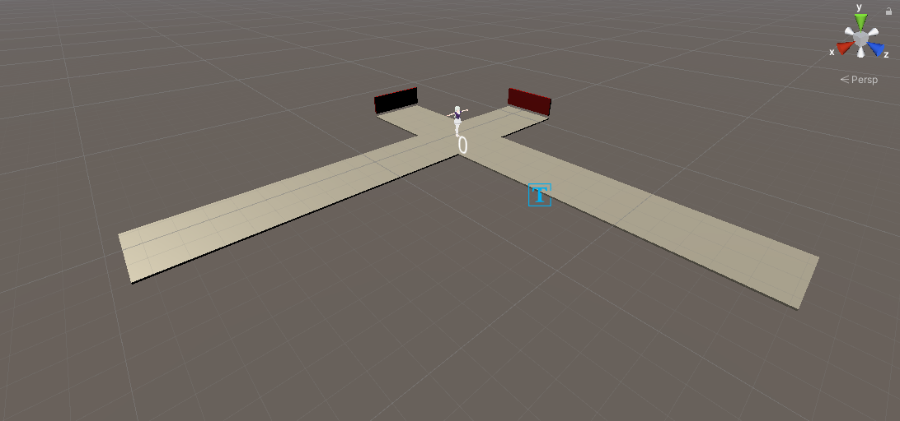
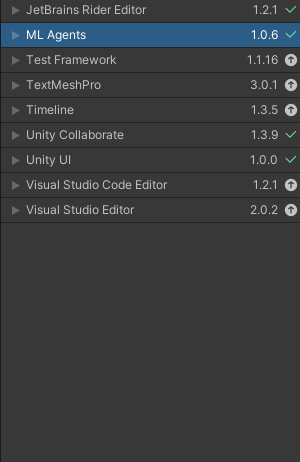
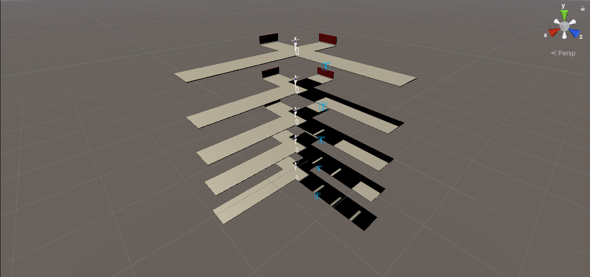
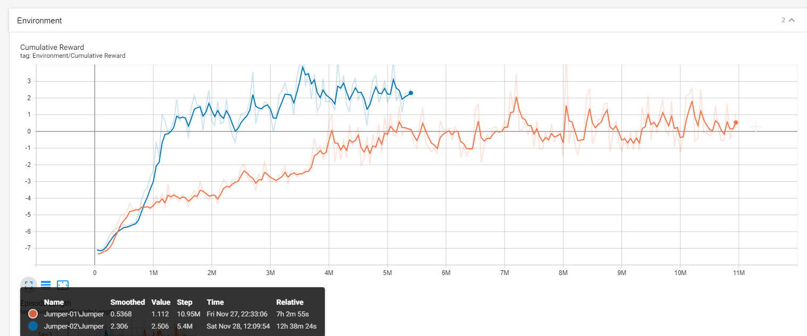

# AI jumper assignment

<center>
Opdracht voor VR Experience

2020 - 2021

Auteurs:
Matthias Verschorren, Kobe de Peuter

</center>

## Inhoudstafel

1. [Intro](#intro)
2. [Het spel](#het-spel)
3. [Acties en beloningen](#acties-en-beloningen)
4. [Setup deel 1: Packages](#setup-deel-1-packages)
5. [Setup deel 2: Scripts](#setup-deel-2-scripts)
6. [Setup deel 3: Scene](#setup-deel-3-scene)
7. [Training](#training)
8. [De training starten](#de-training-starten)
9. [Training resultaten](#training-resultaten)


## Intro

In dit Unity project leren we een AI om over obstakels te springen op een kruispunt van 2 wegen. Hier hebben we gekozen om te werken met levens op de speler.
Standaard begint de speler met 5 levens en verliest een leven door geraakt te worden door een kubus.
Indien de speler succesvol over 100 kubussen springt zal het spel eindigen en opnieuw gestart worden, dit geld ook voor de levens zodat wanneer deze op zijn het spel ook opnieuw herstart.

## Het spel



We zien hier dat de speler altijd op dezelfde positie staat op het kruispunt.
Op de 2 banen zullen dan blokken aankomen aan random intervals waar de player dan zal moeten over springen om zo score te behalen.

## Acties en beloningen

hieronder zien we de rewards die de player telkens zal krijgen per actie die hij onderneemt.

| Omschrijving              | Beloning          |
| ------------------------- | ----------------- |
| Aanraken van een obstakel | -1                |
| Springen                  | -0.2              |
| Kubus bereikt finish gate | +1                |


## Setup deel 1: Packages



Hier zien we de packages die we voor dit project gebruikt hebben.


## Setup deel 2: Scripts

Voor onze jumper game zijn er 3 scripts nodig. Deze zijn bijgeleverd bij het project en kunnen dus ook gebruikt worden.

Indien we de scripts gaan bekijken zien we dat we gebruik gemaakt hebben van enkele custom methods om zo de kubussen te spawnen en te bepalen wanneer een episode eindigt.

`Enemy.cs`
```c#
public class Enemy : MonoBehaviour
{
    public static float speed = 1f;
    private Playercontroller player;
    public Vector3 movedirection = Vector3.back;
    // Start is called before the first frame update
    void Start()
    {
        player = GetComponentInParent<Environment>().player;
    }

    // Update is called once per frame
    void Update()
    {
        transform.position += movedirection * speed * Time.deltaTime;
    }

    private void OnTriggerEnter(Collider other)
    {
        if (other.tag == "KillGate")
        {
            Destroy(this.gameObject);

            player.AddReward(0.5f);
            player.blocksJumpedOver++;
            if (player.blocksJumpedOver >= 100)
            {
                player.EndEpisode();
            }
        }
    }

    private void OnCollisionEnter(Collision collision)
    {
        if (collision.gameObject.tag == "Player")
        {
            Destroy(this.gameObject);
            player.AddReward(-1);
            player.lifes--;
            if (player.lifes <= 0)
            {
                player.EndEpisode();
            }
        }
    }
}

```
`Environment.cs`
```c#
public class Environment : MonoBehaviour
{
    public Enemy enemyPrefab;

    public Playercontroller player;
    private GameObject enemies;
    private GameObject enemies2;
    private TextMeshPro scoreBoard;
    public Transform spawnPos;

    // Start is called before the first frame update
    void Start()
    {
        player = transform.GetComponentInChildren<Playercontroller>();
        enemies = transform.Find("Enemies").gameObject;
        enemies2 = transform.Find("Enemies2").gameObject;
        scoreBoard = transform.GetComponentInChildren<TextMeshPro>();
    }

    private void FixedUpdate()
    {
        scoreBoard.text = player.GetCumulativeReward().ToString("f3");
    }

    // Update is called once per frame
    void Update()
    {

    }

    void spawnEnemy()
    {
        GameObject enemy = Instantiate(enemyPrefab.gameObject);
        enemy.transform.SetParent(enemies.transform);
        enemy.transform.localPosition = new Vector3(0,0,0);
        enemy.GetComponent<Enemy>().movedirection = Vector3.back;
        float randtime = Random.Range(4, 9);
        Invoke("spawnEnemy", randtime);
    }

    void spawnEnemyCrossroad()
    {
        GameObject enemy = Instantiate(enemyPrefab.gameObject);
        enemy.transform.SetParent(enemies2.transform);
        enemy.GetComponent<Enemy>().movedirection = Vector3.left;
        enemy.transform.localPosition = new Vector3(0, 0, 0);

        float randtime = Random.Range(4, 9);
        Invoke("spawnEnemyCrossroad", randtime);
    }

    public void ResetEnvironment()
    {
        CancelInvoke();
        foreach (Transform enemy in enemies.transform)
        {
            Destroy(enemy.gameObject);   
        }
        foreach (Transform enemy in enemies2.transform)
        {
            Destroy(enemy.gameObject);
        }
        Invoke("spawnEnemy", Random.Range(1, 3));
        Invoke("spawnEnemyCrossroad", Random.Range(1, 3));
    }
}

```
`Playercontroller.cs`
```c#
public class Playercontroller : Agent
{
    public float jumpHeight = 5;
    private Rigidbody body;
    bool isGrounded = false;
    internal int lifes = 5;
    public int defaultLives = 5;
    internal int blocksJumpedOver = 0;

    public override void Initialize()
    {
        base.Initialize();
        body = GetComponent<Rigidbody>();
        body.freezeRotation = true;
    }
    private void OnCollisionStay(Collision collision)
    {
        isGrounded = true;
    }

    public override void OnEpisodeBegin()
    {
        transform.localPosition = new Vector3(0, 0.6f, -4.6f);
        transform.localRotation = Quaternion.Euler(0, 0, 0);
        body.angularVelocity = Vector3.zero;
        body.velocity = Vector3.zero;
        Enemy.speed = Random.Range(3f, 5f);
        GetComponentInParent<Environment>().ResetEnvironment();
        lifes = defaultLives;
        blocksJumpedOver = 0;
        Debug.Log("Enemy speed" + Enemy.speed);
    }

    public override void Heuristic(float[] actionsOut)
    {
        actionsOut[0] = 0f;
        if (Input.GetKey(KeyCode.Space))
        {            
            actionsOut[0] = 1f;
        }

    }

    public override void OnActionReceived(float[] vectorAction)
    {
        if (vectorAction[0] != 0 && isGrounded)
        {
            isGrounded = false;
            AddReward(-0.1f);
            body.AddForce(transform.up * jumpHeight, ForceMode.Impulse);
        }
    }
}

```


## Setup deel 3: Scene



Hier zien we dat we gebruik gemaakt hebben van 5 environments die tegelijk zullen trainen wanneer de training gestart word.
Ook zullen we opmerken dat we de standaard waarde voor de trainingssnelheid hebben aangepast naar 5 i.p.v 20 om zo een duidelijker beeld van de training te krijgen en een bug die unity heeft te omzeilen.

De bug die ik hierboven aanhaal is het niet correct vernietigen van objecten die de killgate doorgaan, we hebben dit kunnen traceren tot de snelheid van de training.

Dit wil zeggen dat wanneer de training te snel gaat unity volgens ons niet kan bijhouden en kubussen door de gate laat gaan zonder deze te vernietigen.

## Training

In de parent folder van ons Unity project maken we een folder aan genaamd `Learning` waar alle resultaten van het Neural Network in zullen komen.

In onze repository is een `Learning` folder te vinden waar de resultaten zich in bevinden.

Hierin maakten we eerst een `Jumper.yml` configuratie-bestand. hier komen dan de instellingen in terecht. Zie configuratie hieronder.

### Configuratiebestand

```yml
behaviors:
  Obelix:
    trainer_type: ppo
    max_steps: -1
    time_horizon: 64
    summary_freq: 10000
    keep_checkpoints: 5
    checkpoint_interval: 50000

    hyperparameters:
      batch_size: 32
      buffer_size: 9600
      learning_rate: 3.0e-4
      learning_rate_schedule: constant
      beta: 5.0e-3
      epsilon: 0.2
      lambd: 0.95
      num_epoch: 3

    network_settings:
      num_layers: 2
      hidden_units: 128
      normalize: false
      vis_encoder_type: simple

    reward_signals:
      extrinsic:
        strength: 1.0
        gamma: 0.99
      curiosity:
        strength: 0.02
        gamma: 0.99
        encoding_size: 256
        learning_rate : 1e-3
```

## De training starten

Indien we de training willen starten kunnen we een anaconda command line opendoen en hierin de environment van ml agents activeren.
```
conda activate <Naam van de ml agents environment>
```
Hierna kunnen we dan de training starten aan de hand van het commando
```
mlagents-learn Jumper.yml --run-id <Naam van de nieuwe training>
```
Indien we dan de resultaten willen monitoren kunnen we dit doen door een tensorboard open te zetten.
```
tensorboard --logdir results
```

## Training resultaten




